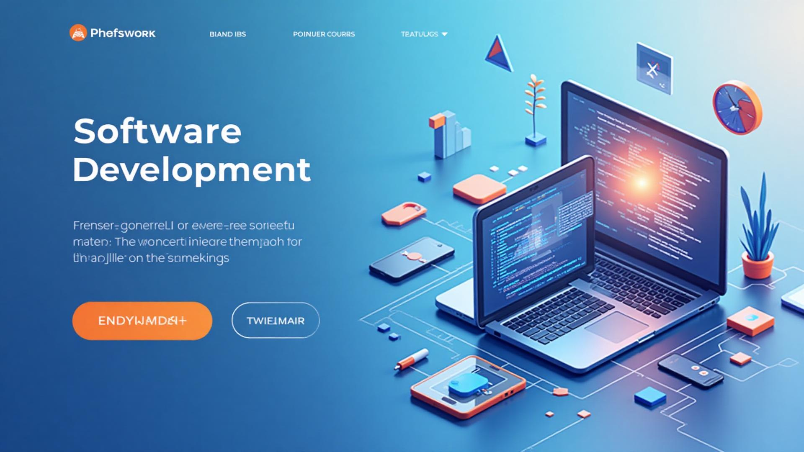

### 🚀 DigitalCraft — Frontend moderno, rápido e acessível

<div align="center">



<br/><br/>


[](https://digitalcraft21.netlify.app/)

</div>

---

## 🔎 Em uma frase
DigitalCraft é uma aplicação React + TypeScript com design system, acessibilidade e performance como pilares — pensada para escala, colaboração e experiência do usuário.

---

## ⚡ À primeira vista

- **UX/A11y**: componentes acessíveis (WCAG), navegação por teclado e foco visível
- **Performance**: lazy loading, code splitting e assets otimizados
- **Design System**: shadcn/ui + Tailwind com tokens, variantes e consistência visual
- **Produtividade**: formulários com React Hook Form + Zod e data‑fetching com TanStack Query
- **Integrações**: fluxo de contato via EmailJS e gráficos com Recharts

<details>
  <summary>Ver mais detalhes</summary>

  - Tema claro/escuro com persistência
  - Navegação: header fixo, scroll suave e menu mobile
  - Componentização com TypeScript 100% e boas práticas de ESLint
  - Estrutura organizada para colaboração em equipe
</details>

---

## 🧭 Quick links

- **Demo**: `https://digitalcraft21.netlify.app/`
- **Como rodar**: seção abaixo em 30s
- **Stack completa**: logo abaixo
- **Roadmap**: visão rápida de próximos passos

---

## 🛠️ Stack

- **Core**: React 18, TypeScript, Vite, React Router
- **UI**: Tailwind CSS, shadcn/ui, Radix, Lucide
- **Dados/UX**: TanStack Query, React Hook Form, Zod, Recharts
- **Build & Qualidade**: ESLint, PostCSS, Tailwind Typography
- **Integrações**: EmailJS

---

## ▶️ Rode em 30 segundos

Pré‑requisito: Node 18+

```bash
npm install
npm run dev
```

Ambiente: `http://localhost:5173`

---

## 🏗️ Estrutura (visão)

```
src/
├─ components/
│  └─ ui/
├─ pages/
├─ hooks/
├─ lib/
├─ config/
└─ assets/
```

---

## 🧱 Arquitetura (alto nível)

```mermaid
graph TD
  A[App (React + Vite)] --> B[Pages / React Router]
  A --> C[Components]
  C --> C1[UI (shadcn/ui + Radix)]
  C --> C2[Feature Components]
  A --> D[Hooks]
  A --> E[Lib]
  E --> E1[utils]
  E --> E2[chat-utils]
  A --> F[Config]
  A --> G[Assets]
  C2 --> H[Recharts]
  C2 --> I[EmailJS]
  D --> J[TanStack Query]
  D --> K[React Hook Form + Zod]
```

---

## 📈 Roadmap rápido

- [ ] PWA e suporte offline
- [ ] i18n (multi‑idiomas)
- [ ] Integração de analytics

<details>
  <summary>Ideias futuras</summary>
  - Melhorias de acessibilidade (testes com leitores de tela)
  - Testes E2E e métricas automatizadas de performance
  - Integração com CMS/headless para conteúdo dinâmico
</details>

---

## 🤝 Contribuição

PRs são bem‑vindos. Siga Conventional Commits e mantenha a cobertura e o lint em dia.

---

## 📄 Licença
MIT — veja `LICENSE`.

---

## 👤 Autor
**Antonio Lucas Costa Araújo**
- LinkedIn: [Perfil](https://www.linkedin.com/in/antonio-lucas-costa-araujo-5462a52b0)
- GitHub: [@ALucas314](https://github.com/ALucas314)
- Portfólio: https://seusite.com

<div align="center">

Se curtiu, deixe uma ⭐ e confira a demo ao vivo!

</div>
